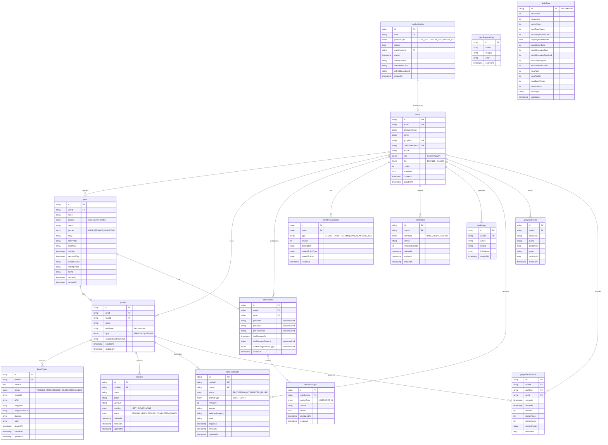

# PetHolo Database Schema — ERD

## Entity Relationship Diagram

## Relationship Summary

| Parent | Child | Cardinality | Description |
|--------|-------|-------------|-------------|
| users | pets | 1:N | 사용자는 여러 반려동물 등록 |
| users | profiles | 1:N | 사용자가 프로필 소유 (userId로 접근 제어) |
| pets | profiles | 1:N | 한 반려동물에 여러 홀로그램 프로필 |
| pets | chatRooms | 1:1 | 반려동물 등록 시 자동 생성 |
| users | chatRooms | 1:N | 사용자별 채팅방 |
| profiles | baseVideos | 1:N (max 3) | 프로필당 최대 3개 베이스 영상 |
| profiles | motions | 1:N (max 12) | 프로필당 최대 12개 모션 |
| chatRooms | chatMessages | 1:N | 채팅방 내 메시지들 |
| users | creditTransactions | 1:N | 크레딧 사용/획득 이력 |
| users | trashItems | 1:N | 삭제된 항목 (30일 복구 가능) |
| users | auditLogs | 1:N | API 사용 감사 로그 |
| profiles | startFrameJobs | 1:N | AI 이미지 생성 작업 |
| productCodes | users | N:1 | 상품 코드 사용자 연결 |
| users | analyticsEvents | 1:N | 사용자 이벤트 트래킹 |
| users | playbackSessions | 1:N | 재생 세션 기록 |
| profiles | playbackSessions | 1:N | 프로필별 재생 세션 |

## Business Constraints

- `baseVideos`: 프로필당 최대 3개 (deletedAt == null 기준)
- `motions`: 프로필당 최대 12개 (deletedAt == null 기준)
- `motions.position`: LEFT/RIGHT 각각 프로필당 1개만 할당 가능
- `baseVideos.isActive`: 프로필당 1개만 true
- `trashItems.expiresAt`: 삭제 후 30일 뒤 영구 삭제
- `startFrameJobs.expiresAt`: 생성 후 30분 내 선택 필요
- `users.credits`: 음수 불가 (spend 시 트랜잭션으로 확인)
- `chatMessages`: PET_AI 메시지는 scheduledAt 이후에만 표시

## Denormalization Strategy

| Source | Target | Fields | Sync Trigger |
|--------|--------|--------|-------------|
| pets | chatRooms | petName, petEmoji, petFrontPhoto | pet 업데이트 시 |
| pets | profiles | petName | pet 업데이트 시 |
| chatMessages | chatRooms | lastMessageContent, lastMessageSenderType | 메시지 발송 시 |

## Composite Indexes

| Collection | Fields | Purpose |
|------------|--------|---------|
| chatRooms | userId ASC, lastMessageAt DESC | 채팅방 목록 정렬 |
| chatMessages | chatRoomId ASC, createdAt DESC | 메시지 서버사이드 페이지네이션 |
| creditTransactions | userId ASC, createdAt DESC | 크레딧 이력 서버사이드 페이지네이션 |
| trashItems | userId ASC, deletedAt DESC | 휴지통 목록 정렬 |
